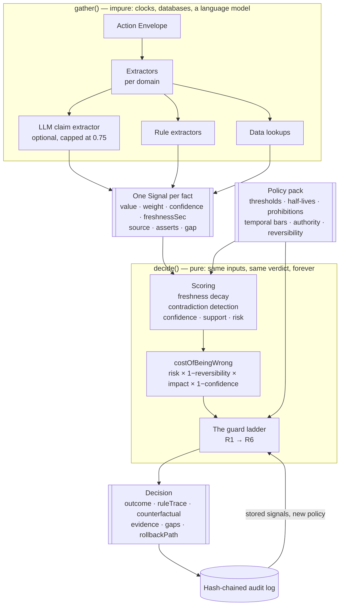
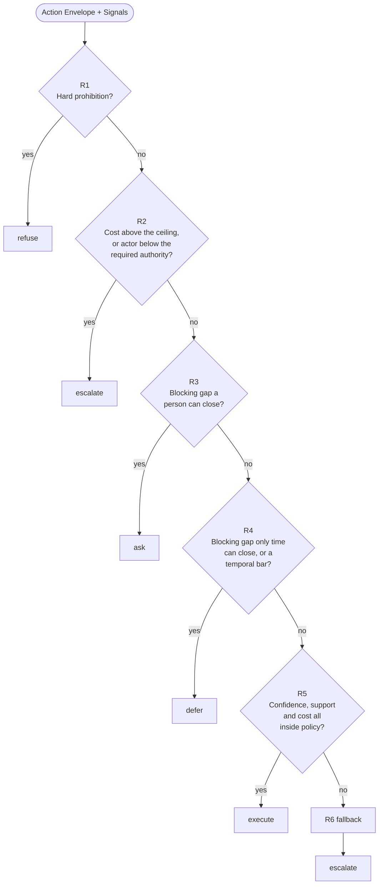

# Architecture

One kernel, three policy packs, and a hard line between the part that talks to the world and the part
that decides.

---

## The shape



The loop at the bottom is replay. Because `decide()` is pure and the audit record stores every signal
that fed it, a decision from six months ago can be re-judged under today's policy without any of the
original systems still being reachable.

---

## The guard ladder



Evaluation stops at the first rule that fires. Every rule is recorded either way.

**There is no arrow from "no rule fired" to `execute`.** That is the entire safety argument, and it
is why R6 exists rather than a default.

---

## Why the pure/impure split is load-bearing

Three features fall out of it for free, and none of them are practical without it:

**Counterfactuals.** "What would have had to be different?" is `decide()` run again against a
perturbed input, one change at a time. Whatever flips is genuinely responsible, because exactly one
thing changed. Extractors are never re-run, so it costs microseconds rather than a round of API
calls.

**Replay.** A stored decision plus a different policy pack gives you the verdict that policy would
have produced. That is what turns "shall we tighten the confidence floor?" into "tightening it to 85%
would have changed 14 of the last 140 decisions, all of them execute becoming escalate."

**Determinism under test.** Every fixture pins its own clock in `context.now`, so a scenario decides
identically on any machine, in any year. The golden test suite is meaningful precisely because a
verdict cannot drift.

---

## The Signal

Everything is built from one record. Rules, database rows, human input and language models all
produce the same thing, and the kernel cannot tell them apart except by the `source` field.

| Field | Why it exists |
|---|---|
| `confidence` | How sure *the source* is. Not how sure we are. Per-signal, not per-decision. |
| `freshnessSec` | Age of the underlying observation, not of the lookup. Decays confidence. |
| `weight` | Importance within its kind. Set by the extractor, overridable by the policy pack. |
| `support` | For evidence: how far this argues the action is justified, 0..1. |
| `asserts` | `{ proposition, polarity }`. Lets the kernel detect contradiction generically. |
| `gap` | For `missing`: the field, who can supply it, and the literal question to ask. |
| `source` | `rule` / `data` / `model` / `human`. Visible in the console on every row. |
| `latencyMs` | What this signal cost to obtain. Recorded, not yet used in decisions. |

Two of these are the ones most entrants will not have, and they do most of the work:
**per-signal confidence** and **freshness**. Together they let the engine say *"I have strong
evidence, but it is old, so I am less sure than I look."*

---

## Freshness decay

```
effectiveConfidence = confidence × 2^(−freshnessSec / halfLifeSec)
```

A true half-life: at exactly one half-life, half the source's confidence survives. `halfLifeSec: 0`
means "never decays" and is used for arithmetic and assertions rather than observations.

The half-life table is the most opinionated part of each policy pack.

| Signal | Half-life | Because |
|---|---|---|
| `return_carrier_status` | 2 days | Describes a parcel still in motion. |
| `carrier_last_scan` | 6 days | Describes a parcel that has stopped moving. |
| `tests_passing` | 6 hours | A statement about a base commit main has since moved past. |
| `customer_chargeback_history` | 90 days | Barely moves in a quarter. |
| `classifier_verdict` | 21 days | A judgement made under an older policy by a model since retrained. |
| `within_refund_window` | never | Arithmetic. |

That asymmetry between the return leg and the outbound leg is the whole of failure test A.

---

## Contradiction detection

Two signals contradict when they assert opposite polarities of the same proposition. The kernel does
not need to know what the proposition means.

```
severity = min(effectiveA, effectiveB) / max(effectiveA, effectiveB)
impact   = severity × max(effectiveA, effectiveB)
confidence *= 1 − impact × contradictionPenalty
```

`severity` asks how *evenly matched* the disagreement is after decay. Two fresh, equally confident
sources pointing opposite ways is the worst case, because nothing tells you which to believe. A fresh
source against a badly decayed one is barely a conflict at all — decay has already settled it, and
the penalty is correspondingly small.

Failure test A asserts exactly this, including that the penalty in that scenario is under 10%. The
contradiction is still *recorded* and shown, because a reviewer needs to know two systems disagreed
even when the arithmetic has already resolved it.

---

## Confidence and support are different numbers

The original plan for this project had one confidence number. That is a hole, and it is worth naming
because it is a hole most scoring engines have:

- **confidence** — how well we know the situation.
- **support** — how far what we know argues for acting.

With one number, a request backed by crisp, fresh, unanimous evidence that it is *not* justified
scores as high-confidence and clears a confidence gate. R5 requires both to be above their floors.

The complement matters too. When support is confidently low the engine escalates; it never refuses.
Refusal is reserved for prohibitions, because "the evidence looks bad" is a judgement a person should
make and "this is under legal hold" is not.

---

## Policy packs

Everything domain-specific lives in one file per domain and nothing else knows about it.

| | Refunds | Deploy | Moderation |
|---|---|---|---|
| Unit | USD | users at risk | people reached |
| Star verdict | `ask` | `defer` | `refuse` |
| Reversibility spread | 0.15 – 0.95 | 0.05 – 0.90 | 0.00 – 0.98 |
| Confidence floor | 72% | 75% | 75% |
| What makes it interesting | Money leaves fast, at volume, mostly clawable | Nothing is missing and the answer is still "not now" | A classifier is genuinely needed and genuinely untrustworthy |

**Moderation's floor is set at 0.75 on purpose.** Model-reported confidence is capped at 0.75 before
the kernel sees it, so no classifier score — however emphatic — can clear that floor on its own.
Something a human already ruled on has to be in the mix. In the shipped corpus, moderation reaches
`execute` only via a perceptual-hash match to a prior, appeal-tested case.

Thresholds are plain data, which is what lets `/api/replay` mutate them. Prohibitions, temporal bars
and the scale functions are predicates over a narrow `PolicyContext` that exposes the envelope and
the signals and nothing else — no clock, no filesystem, no network. That restriction is what makes a
decision replayable months later.

---

## Which absences block is a policy question

Extractors report what is missing. The *pack* decides which of those fields hold up the decision:

```ts
blockingFields: ['return_tracking_number', 'damage_photos', 'payout_account_verification']
```

That is why replaying under a stricter pack can turn a past `execute` into an `ask` without
re-running a single extractor, and why widening this list is the cheapest way to make the engine more
cautious — with `/api/replay` to tell you what it would have cost.

Non-blocking gaps still drag confidence down, because a `missing` signal contributes zero confidence
at its own weight. No special case in the arithmetic; the absence of knowledge is modelled as
knowledge with a confidence of zero.

---

## Counterfactuals, and where they stop

Each perturbation changes exactly one thing:

1. Close a blocking gap, favourably.
2. Refresh a stale signal to zero age.
3. Raise the actor's authority to the required level.
4. Clear a material risk signal.
5. Wait out a temporal bar.

Closing a gap is more than deleting the hole. A `GapSpec` can declare `ifSupplied`, naming the signals
the answer would supersede and the payload fields it would fill in — because a rollback plan that now
exists makes the deploy genuinely more *reversible*, not merely better documented. Without that the
counterfactual is quietly wrong in the pessimistic direction, which is exactly the bug the first
implementation had.

**There is deliberately no perturbation for R1.** A refusal is not a threshold you can climb over,
and publishing a route around a prohibition would teach people to look for one. The console says so
in place of a list.

---

## Audit and replay

Records are sealed with `SHA-256(canonicalJson(record without its hash))` and each stores the
previous record's hash. Key order is normalised before hashing so structurally identical records hash
identically.

Recording how a decision actually turned out reseals the chain from that point forward rather than
editing in place. The log stays append-only; amendments are visible rather than silent.

The seeded corpus is generated, not canned: 350 variants of the shipped fixtures, produced by a
seeded PRNG and run through the real pipeline. Every record in it is a decision the engine actually
made, with a real hash. The generator is deterministic, so a judge running locally sees the same
replay numbers as the hosted demo.

---

## What we did not fix

**Threshold gaming, past the 24-hour window.** The mitigation judges the rolling (actor, customer)
total rather than the single request, which stops the impatient attacker. Spread the same money over
five weeks and it is invisible; spread it across eleven customer accounts and it is invisible even
inside the window, because the engine cannot tell that eleven accounts are one person. Lengthening
the window is not the fix — tripling it to three days recovers $450 of $4,500 in the shipped test,
and every extra day drags legitimate high-volume agents over the line. The real fix is identity
resolution across accounts and payment instruments: a different system, holding different data.
Proven both ways in `tests/failure-b.spec.ts`.

**The hash chain is single-writer.** It detects tampering by anyone who cannot rewrite the whole
file. It does not stop an attacker with write access who recomputes the chain from the edit forward.
Real tamper-evidence needs the head published somewhere the writer does not control — a transparency
log, a co-signed checkpoint, anything external. That is a deployment concern this repository does not
address.

**Half-lives and weights are hand-set.** They encode plausible operational judgement, not measured
error rates. A real deployment would fit them against realised outcomes. The `realisedOutcome` field
on every audit record and `POST /api/decisions/:auditId` are the hooks for that; nothing currently
consumes them. Until something does, the engine is well calibrated only in the sense that its
thresholds are explicit and auditable — not in the statistical sense.

**The naive baseline is a constructed strawman.** Its rule is written out in full at the top of
`core/naive.ts` so the comparison can be checked rather than taken on trust. It is not a claim about
any particular product; it exists to isolate what freshness decay and contradiction detection
actually buy.

**No authentication, no rate limiting, no identity resolution.** The engine assumes something
upstream has established who the actor is and that `authorityLevel` means what it says. It is a
decision layer, not a platform.

**The hosted demo's audit log does not survive a redeploy.** Vercel's filesystem is read-only, so the
deployed build uses the memory store and reseeds on cold start. Locally it appends JSONL to disk and
persists. Swapping in Postgres means implementing one interface in `audit/store.ts`; nothing else in
the repository changes.

**One language model signal, and only one.** The model reads free text and reports what it claims.
It does not weigh, rank, or decide, and it is not consulted about the verdict. That is a deliberate
ceiling on how useful the model is allowed to be here, and a real system would probably want more
model-derived signals — each one capped and discounted the same way.
